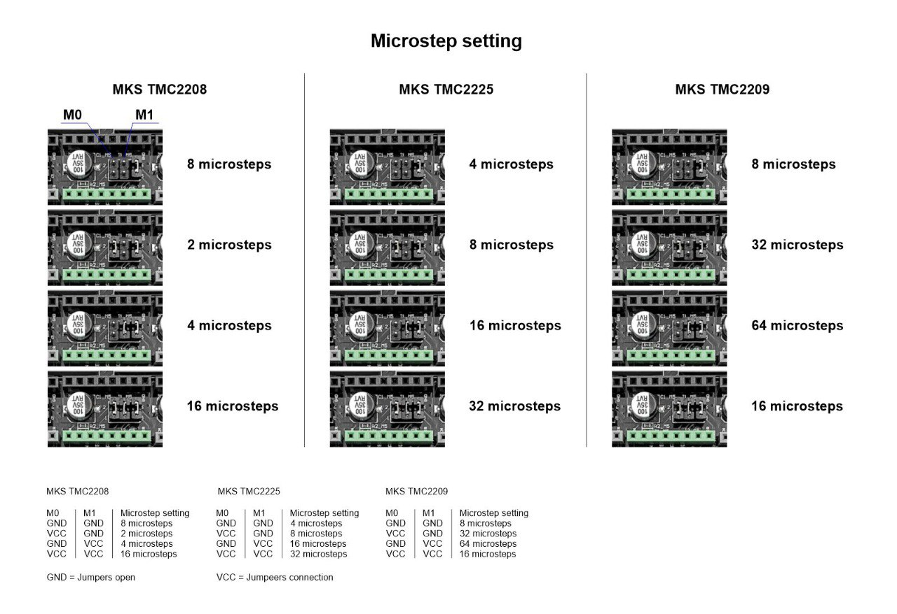
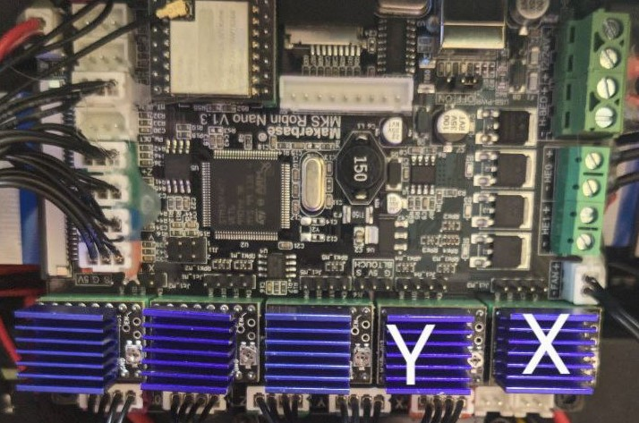
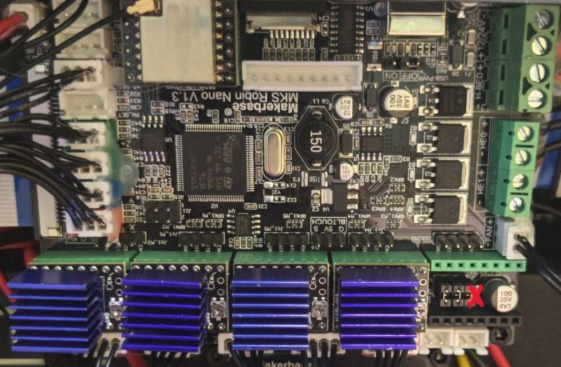

# Решение скрежета при перемещение

Если у вас при перемещение (преимущественно диагональном) головы вы слышите примерно такой звук:

[Пример 1](https://t.me/Reborn_3D/1/167654)

[Пример 2](https://t.me/Reborn_3D/196611/251289)

То у вас с большой вероятностью так называемый "Рев кабана"

## Решение

Решение показано на плате `MKS Robin Nano v1.3` и драйверах `MKS TMC2225`

??? Драйвера 
    

1) Необходимо убрать перемычку под драйверами `X` и `Y` переключив дробление шагов с `32` на `16`.

=== "Шаг 1"
    

=== "Шаг 2"
    

2) Уменьшить в прошивке микрошаги для `X` и `Y` так же в двое.

===+ "Klipper"
    ```  title="printer.cfg"
    [stepper_x]
    microsteps: 16
    ```
    ```  title="printer.cfg"
    [stepper_y]
    microsteps: 16
    ```

=== "Marlin"
    Найти раздел где изменяются шаги.
    
    По умолчанию на `X` и `Y` будет стоять `160` нужно изменить на `80`.

